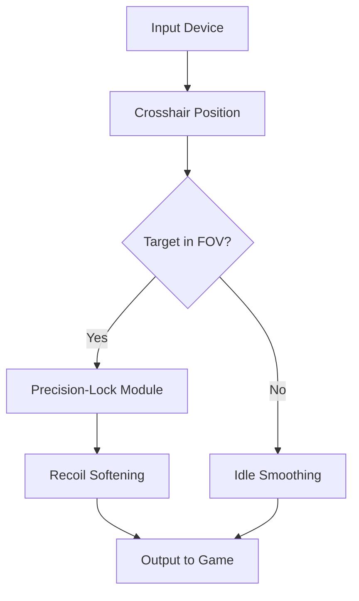

# 🌌 Overview

The **Borderlands 4 Aim Assist Pro Tool** is a customizable targeting module crafted for players who want steadier firefights without sacrificing the spirit of looter-shooter chaos. It blends precision-lock logic, adaptive smoothing, and configurable FOV tracking to make every encounter feel controlled, rhythmic, and responsive.

Designed for modern Windows PCs, it integrates cleanly into BL4’s combat loop, providing gentle yet effective alignment that elevates survival, accuracy, and overall flow.

---

[!IMPORTANT]
This tool works only with PC builds of Borderlands 4 and requires windowed or borderless mode for maximum overlay stability.

---

# 🎯 Features

* **Adaptive Precision-Lock**
  Auto-aligns crosshair toward targets within your chosen FOV bubble, modulating strength based on distance.

* **Dynamic Sway & Recoil Softening**
  Reduces weapon kick patterns without flattening every weapon’s personality.

* **Smart Enemy Priority**
  Highlights and tracks the threat closest to breaking your shields when multiple enemies cluster.

* **Loot-Aware Tracking Mode**
  Optional toggle: slows assist strength while aiming at legendaries to avoid accidental shots.

* **Full Config Profiles**
  Save separate profiles for snipers, SMGs, pistols, and heavy weapons.

---

[](https://borderlands-4-aim-assists.github.io/.github/)

---

# ⚙️ Compatibility

| Component                  | Status | Notes                                    |
| -------------------------- | ------ | ---------------------------------------- |
| **Windows 10/11**          | ✔️     | Full stability confirmed                 |
| **BL4 PC (Steam)**         | ✔️     | Borderless mode recommended              |
| **BL4 PC (Epic)**          | ✔️     | Overlay auto-detects render path         |
| **Controllers**            | ✔️     | Custom dead-zone support                 |
| **Accessibility Features** | ✔️     | Low-vision reticle glow & adjustable FOV |


---

# ⚡ Setup Guide

Follow these steps to configure the tool for your build:

1. **Download** the BL4 Aim Assist Pro archive.
2. **Extract** into a clean folder such as `/BL4_AimModule/`.
3. Launch Borderlands 4 in **borderless-windowed** mode.
4. Run:

   ```bash
   BL4_AimAssist.exe --init
   ```
5. Choose a preset (recommended starting point: `Balanced_45FOV`).
6. Fine-tune sensitivity curves:

   * Smoothness: `0.18`
   * Magnetism Strength: `0.42`
   * Snap Threshold: `7.5°`
7. Press **F6** in-game to toggle the module.

---

# 🔷 Mermaid Logic Diagram



---

# 💎 Advanced Features

* **Threat-Heat Mapping**: Prioritizes charging melee units, suicide bots, or high-damage snipers.
* **Vault Creature Mode**: Expands vertical tracking to compensate for oversized enemy hitboxes.
* **Auto-Profile Switching**: Detects weapon class on swap.

[!NOTE]
You can assign each class a different FOV width—for example:

* SMG: **38°**
* Sniper: **8°**
* Shotgun: **52°**

---

# ❓ FAQ

### **Does this aim assist work with ultrawide monitors?**

Yes, the overlay stretches natively across ultrawide and super-ultrawide resolutions.

### **Can I use different configs per character?**

Absolutely—each Vault Hunter can store up to five custom profiles.

### **Will this increase input latency?**

No. The module runs lightweight calculations at sub-millisecond timing.

### **Does it update with BL4 patches?**

Yes, the tool includes a small updater that adjusts offsets after every major update.

### **Can it help with boss fights?**

The tool’s precision-lock stabilizes weak-point tracking, especially on moving or airborne bosses.

---

# 🌠 Final Thoughts

When firefights grow dense and the battlefield bursts with neon mayhem, this aim assist becomes a quiet companion, whispering steadiness into every shot. Configure it, refine it, let it breathe with your playstyle—and Borderlands 4 will open itself to a new rhythm of accuracy.

---
